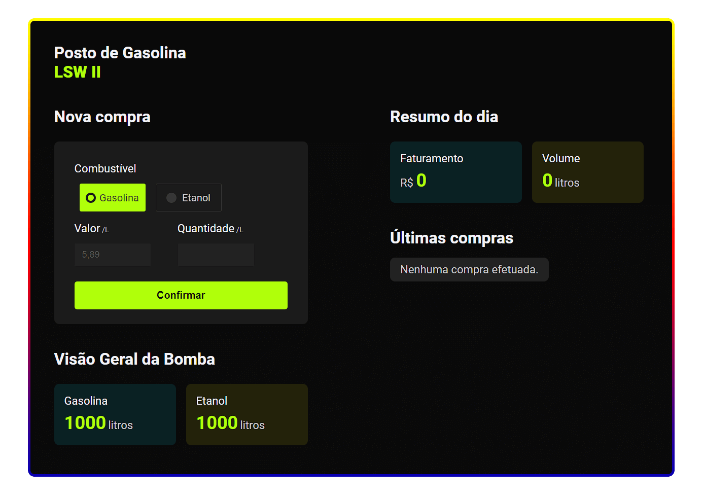

# Filling Station LSW II
2nd JavaScript project for Instituto Federal do Triângulo Mineiro @ Brazil

## General infos
* [📃 Read original proposal (pt-BR)](#original-proposal)
* [✒️ See the prototype on Figma](https://www.figma.com/file/zKg0S3bWPGTMGzunwCxTRb/IFTM-Avalia%C3%A7%C3%A3o-2)
* [📧 Contact-me :)](mailto:eu@frontedu.me)



## Original proposal
### Atividade Avaliativa II
Esta é a proposta de segunda avaliação da disciplina de Linguagem de Script para WEB. Ela deve ser realizada individualmente. 
O valor total desta avaliação é de 30 pontos. Não serão admitidos códigos idênticos ou com indícios de cópia entre os integrantes da turma. Esta avaliação ocorrerá em duas etapas:
- Assíncrona: o aluno realiza o desenvolvimento da especificação da atividade apresentada adiante.
- Síncrona: haverá a apresentação do que foi feito para a professora no dia 08/06 com compartilhamento de tela por parte do aluno. Para isso, utilizaremos o Google Meet para a chamada geral e cada um irá me apresentar individualmente por meio do Discord.

#### Especificação da atividade
Desenvolver uma aplicação WEB para a visualização em tempo real da situação de uma bomba de combustível. Você vai desenvolver uma página WEB utilizando HTML5, CSS3 e JavaScript.

##### A página possui três seções bem definidas:
- Visão geral da bomba: Apresenta a quantidade, em litros, disponível que aquela bomba opera. No exemplo, a Bomba 1 opera com gasolina e etanol e iniciou o dia com 1000L de cada tipo de combustível.
- Compra: Serve para registrar as compras do dia em litros.
- Resumo do dia: Mostra a relação das vendas realizadas no dia.

##### Para desenvolver o sistema, considere que na seção de Compra:
- O preço do etanol e gasolina já vão estar definidos por padrão. Portanto, não podem ser editáveis. No exemplo, a gasolina possui o valor por litro igual a R$ 5,89 e o etanol R$ 3,99.
- O campo quantidade em litros deve receber um valor numérico informando a quantidade de litros da compra.

##### Ao clicar no botão confirmar algumas ações devem ocorrer na tela:
- O valor dos litros da seção “Visão Geral da Bomba” devem ser atualizados.
- O valor contido em “Total” deve ser atualizado.
- Além disso, na seção “Resumo do dia” deve ser apresentada uma listagem com o resumo da compra da seguinte forma:
```
<nome combustível> - <quantidade em litros> - R$ <valor da compra>
```

##### Na seção Visão Geral da Bomba deve ser considerado que:
- Caso a bomba possua uma quantidade maior ou igual a 500 o valor do total de litros deve ser apresentado em verde; se a quantidade estiver entre 100 e 500 esse valor deve ser apresentado em laranja; se for menor que 100 deve ser apresentado em vermelho; e se for menor ou igual a zero em cinza.
- Uma compra só pode ser realizada se a quantidade de litros pretendida for inferior ou igual à disponível, caso contrário, uma mensagem deve ser apresentada ao usuário: “Impossível concluir a venda por falta de combustível”.
